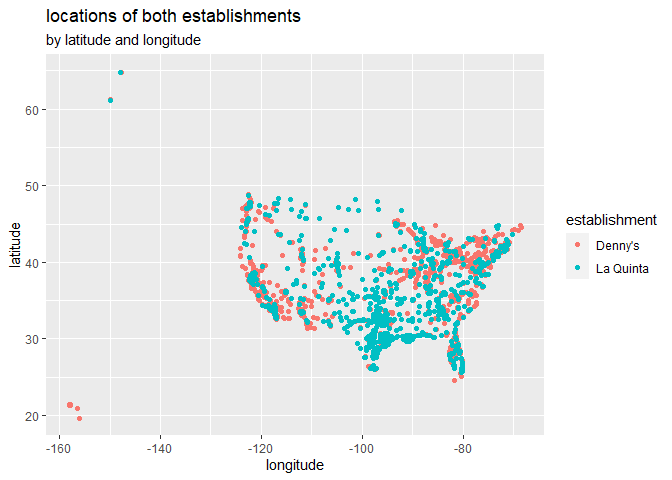
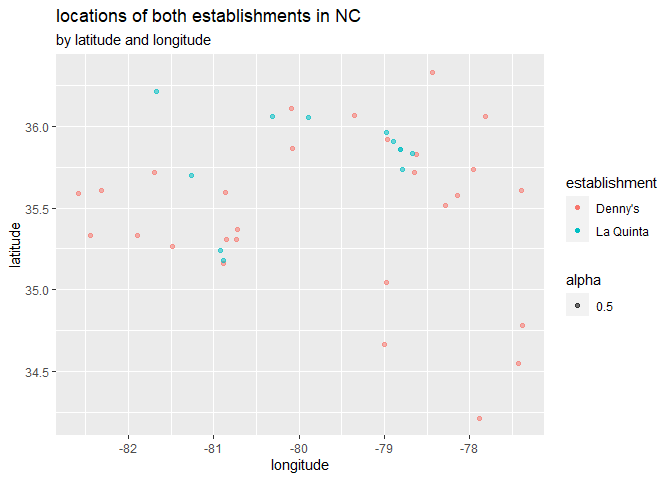
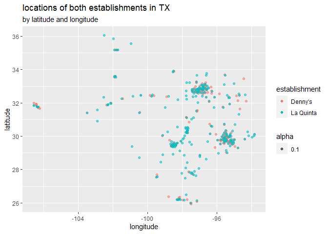

Lab 04 - La Quinta is Spanish for next to Denny’s, Pt. 1
================
Fanyi Zeng
02/06/22

### Load packages and data

``` r
library(tidyverse) 
load("C:/Users/zengf/Desktop/Data Science/Lab4/dennys.rda")
load("C:/Users/zengf/Desktop/Data Science/Lab4/laquinta.rda")
```

``` r
states <- read_csv("data/states.csv")
```

### Exercise 1

denny’s dataset dimensions: 6 columns and 1643 rows each row represents
a single denny’s store each column represents a variable - (street)
address, city, state, zip, longitude, latitude

``` r
ncol(dennys)
```

    ## [1] 6

``` r
nrow(dennys)
```

    ## [1] 1643

``` r
head(dennys)
```

    ## # A tibble: 6 x 6
    ##   address                        city       state zip   longitude latitude
    ##   <chr>                          <chr>      <chr> <chr>     <dbl>    <dbl>
    ## 1 2900 Denali                    Anchorage  AK    99503    -150.      61.2
    ## 2 3850 Debarr Road               Anchorage  AK    99508    -150.      61.2
    ## 3 1929 Airport Way               Fairbanks  AK    99701    -148.      64.8
    ## 4 230 Connector Dr               Auburn     AL    36849     -85.5     32.6
    ## 5 224 Daniel Payne Drive N       Birmingham AL    35207     -86.8     33.6
    ## 6 900 16th St S, Commons on Gree Birmingham AL    35294     -86.8     33.5

### Exercise 2

la quinta’s dataset dimensions: 6 columns and 909 rows each row
represents a single la quinta hotel each column represents a variable -
(street) address, city, state, zip, longitude, latitude

``` r
ncol(laquinta)
```

    ## [1] 6

``` r
nrow(laquinta)
```

    ## [1] 909

``` r
head(laquinta)
```

    ## # A tibble: 6 x 6
    ##   address                    city         state zip   longitude latitude
    ##   <chr>                      <chr>        <chr> <chr>     <dbl>    <dbl>
    ## 1 793 W. Bel Air Avenue      "\nAberdeen" MD    21001     -76.2     39.5
    ## 2 3018 CatClaw Dr            "\nAbilene"  TX    79606     -99.8     32.4
    ## 3 3501 West Lake Rd          "\nAbilene"  TX    79601     -99.7     32.5
    ## 4 184 North Point Way        "\nAcworth"  GA    30102     -84.7     34.1
    ## 5 2828 East Arlington Street "\nAda"      OK    74820     -96.6     34.8
    ## 6 14925 Landmark Blvd        "\nAddison"  TX    75254     -96.8     33.0

### Exercise 3

All Denny’s locations are within the country. Let’s add a country
variable for Denny’s.

``` r
dennys %>%
  filter(!(state %in% states$abbreviation))
```

    ## # A tibble: 0 x 6
    ## # ... with 6 variables: address <chr>, city <chr>, state <chr>, zip <chr>,
    ## #   longitude <dbl>, latitude <dbl>

``` r
dennys <- dennys %>%
  mutate(country = "United States")
```

### Exercise 4

La Quinta have locations outside of US, including Mexico, Canada, China,
New Zealand, Honduras, Turkey, United Arab Emirates, Chile, and
Colombia.

``` r
laquinta %>%
  filter(!(state %in% states$abbreviation))
```

    ## # A tibble: 14 x 6
    ##    address                     city               state zip   longitude latitude
    ##    <chr>                       <chr>              <chr> <chr>     <dbl>    <dbl>
    ##  1 Carretera Panamericana Sur~ "\nAguascalientes" AG    20345    -102.     21.8 
    ##  2 Av. Tulum Mza. 14 S.M. 4 L~ "\nCancun"         QR    77500     -86.8    21.2 
    ##  3 Ejercito Nacional 8211      "Col\nPartido Igl~ CH    32528    -106.     31.7 
    ##  4 Blvd. Aeropuerto 4001       "Parque Industria~ NL    66600    -100.     25.8 
    ##  5 Carrera 38 # 26-13 Avenida~ "\nMedellin Colom~ ANT   0500~     -75.6     6.22
    ##  6 AV. PINO SUAREZ No. 1001    "Col. Centro\nMon~ NL    64000    -100.     25.7 
    ##  7 Av. Fidel Velazquez #3000 ~ "\nMonterrey"      NL    64190    -100.     25.7 
    ##  8 63 King Street East         "\nOshawa"         ON    L1H1~     -78.9    43.9 
    ##  9 Calle Las Torres-1 Colonia~ "\nPoza Rica"      VE    93210     -97.4    20.6 
    ## 10 Blvd. Audi N. 3 Ciudad Mod~ "\nSan Jose Chiap~ PU    75010     -97.8    19.2 
    ## 11 Ave. Zeta del Cochero No 4~ "Col. ReservaTerr~ PU    72810     -98.2    19.0 
    ## 12 Av. Benito Juarez 1230 B (~ "\nSan Luis Potos~ SL    78399    -101.     22.1 
    ## 13 Blvd. Fuerza Armadas        "contiguo Mall La~ FM    11101     -87.2    14.1 
    ## 14 8640 Alexandra Rd           "\nRichmond"       BC    V6X1~    -123.     49.2

### Exercise 5

Let’s add a country variable for la quinta.

``` r
laquinta <- laquinta %>%
  mutate(country = case_when(
    state %in% state.abb     ~ "United States",
    state %in% c("ON", "BC") ~ "Canada",
    state == "ANT"           ~ "Colombia",
    state %in% c("AG", "QR", "CH", "NL", "VE", "PU", "SL") ~ "Mexico",
    state == "FM" ~ "Honduras"))
```

### Exercise 6

Let’s filter out non-US locations.

``` r
laquinta <- laquinta %>%
  filter(country == "United States")
```

### Exercise 7

CA has the most Denny’s locations. TX has the most La Quinta’s
locations.

``` r
dennys %>%
  count(state) %>%
  arrange(desc(n))
```

    ## # A tibble: 51 x 2
    ##    state     n
    ##    <chr> <int>
    ##  1 CA      403
    ##  2 TX      200
    ##  3 FL      140
    ##  4 AZ       83
    ##  5 IL       56
    ##  6 NY       56
    ##  7 WA       49
    ##  8 OH       44
    ##  9 MO       42
    ## 10 PA       40
    ## # ... with 41 more rows

``` r
laquinta %>%
  count(state) %>%
  arrange(desc(n))
```

    ## # A tibble: 48 x 2
    ##    state     n
    ##    <chr> <int>
    ##  1 TX      237
    ##  2 FL       74
    ##  3 CA       56
    ##  4 GA       41
    ##  5 TN       30
    ##  6 OK       29
    ##  7 LA       28
    ##  8 CO       27
    ##  9 NM       19
    ## 10 NY       19
    ## # ... with 38 more rows

Per square thousand miles: DC has the most Denny’s locations per 1000 sq
miles. RI has the most La Quinta’s locations per 1000 sq miles.

``` r
dennys %>%
  count(state) %>%
  inner_join(states, by = c("state" = "abbreviation")) %>%
  mutate(concentration = n/area*1000) %>%
  arrange(desc(concentration))
```

    ## # A tibble: 51 x 5
    ##    state     n name                     area concentration
    ##    <chr> <int> <chr>                   <dbl>         <dbl>
    ##  1 DC        2 District of Columbia     68.3        29.3  
    ##  2 RI        5 Rhode Island           1545.          3.24 
    ##  3 CA      403 California           163695.          2.46 
    ##  4 CT       12 Connecticut            5543.          2.16 
    ##  5 FL      140 Florida               65758.          2.13 
    ##  6 MD       26 Maryland              12406.          2.10 
    ##  7 NJ       10 New Jersey             8723.          1.15 
    ##  8 NY       56 New York              54555.          1.03 
    ##  9 IN       37 Indiana               36420.          1.02 
    ## 10 OH       44 Ohio                  44826.          0.982
    ## # ... with 41 more rows

``` r
laquinta %>%
  count(state) %>%
  inner_join(states, by = c("state" = "abbreviation")) %>%
  mutate(conc = n/area*1000) %>%
  arrange(desc(conc))
```

    ## # A tibble: 48 x 5
    ##    state     n name             area  conc
    ##    <chr> <int> <chr>           <dbl> <dbl>
    ##  1 RI        2 Rhode Island    1545. 1.29 
    ##  2 FL       74 Florida        65758. 1.13 
    ##  3 CT        6 Connecticut     5543. 1.08 
    ##  4 MD       13 Maryland       12406. 1.05 
    ##  5 TX      237 Texas         268596. 0.882
    ##  6 TN       30 Tennessee      42144. 0.712
    ##  7 GA       41 Georgia        59425. 0.690
    ##  8 NJ        5 New Jersey      8723. 0.573
    ##  9 MA        6 Massachusetts  10554. 0.568
    ## 10 LA       28 Louisiana      52378. 0.535
    ## # ... with 38 more rows

### Excersie 8

Let’s plot the locations for both establishments in the U.S. and then in
NC. We can see that not every La Quinta has a Denny’s nearby. However,
it seems to hold for TX.

``` r
dennys <- dennys %>%
  mutate(establishment = "Denny's")
laquinta <- laquinta %>%
  mutate(establishment = "La Quinta")
dn_lq <- bind_rows(dennys, laquinta)
ggplot(dn_lq, mapping = aes(x = longitude, y = latitude, color = establishment)) +
  geom_point() +
  labs(title = "locations of both establishments", subtitle = "by latitude and longitude")
```

<!-- -->

``` r
dn_lq %>%
  filter(state == "NC") %>%
  ggplot(data, mapping = aes(x = longitude, y = latitude, color = establishment, alpha = 0.5)) +
  geom_point() +
  labs(title = "locations of both establishments in NC", subtitle = "by latitude and longitude")
```

<!-- -->

``` r
dn_lq %>%
  filter(state == "TX") %>%
  ggplot(data, mapping = aes(x = longitude, y = latitude, color = establishment, alpha = 0.1)) +
  geom_point() +
  labs(title = "locations of both establishments in TX", subtitle = "by latitude and longitude")
```

<!-- -->
